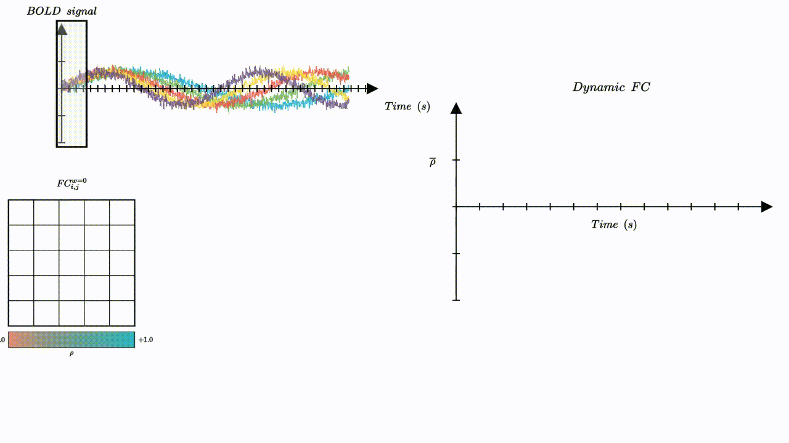
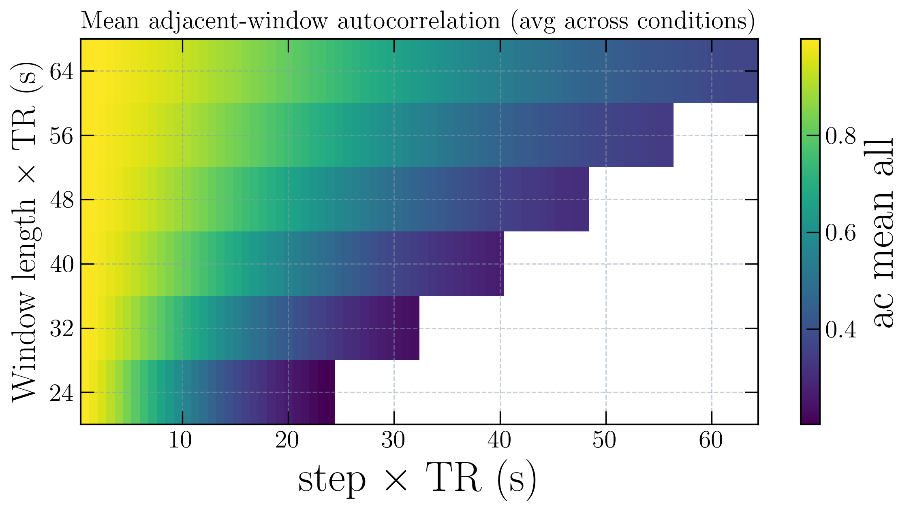
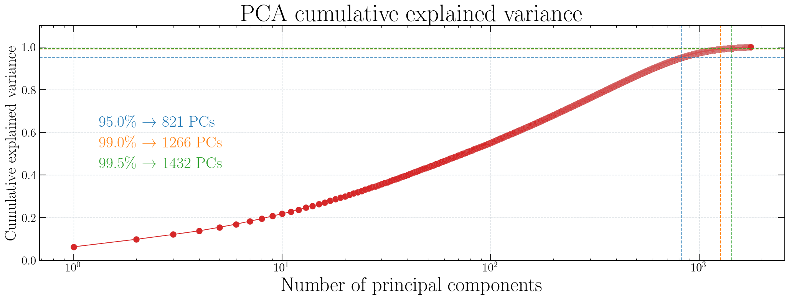
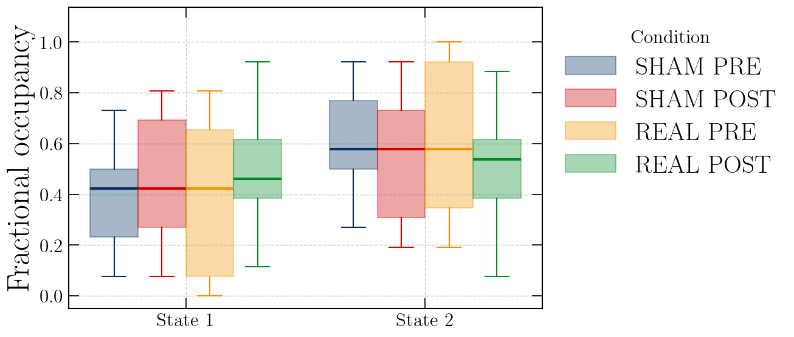
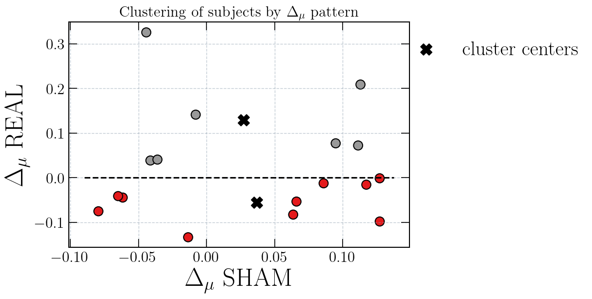

# Dynamic Functional Connectivity (dFC) Analysis
### Methods, Implementation and Preliminary Findings in the TACSI Experiment

This repository contains a complete Python pipeline for computing, analyzing, and visualizing dynamic Functional Connectivity (dFC) using sliding-window correlations, PCA-based dimensionality reduction, and k-means clustering. The workflow has been specifically applied to fMRI data from the TACSI (tACS + iTBS) experiment, processed with fMRIPrep and parcellated into 216 ROIs (200 cortical - Schaefer atlas, 17 Yeo networks; 16 subcortical - Tian atlas).

The goal of this analysis is to investigate how gamma tACS combined with iTBS modulates the functional dynamics of the Precuneus–Hippocampus (PC–HIP) system, comparing REAL stimulation vs SHAM conditions.

## Table of Contents

1. [Background](#background)
2. [Repository Structure](#repository-structure)
3. [Pipeline Overview](#pipeline-overview)
4. [Sliding Window dFC](#sliding-window-dFC)
5. [PCA and K-means Clustering](#PCA-and-K-means-clustering)
6. [State Metrics](#state-metrics)
7. [Statistical Comparisons](#statistical-comparisons)
8. [Experimental Findings](#experimental-findings-sham-vs-real)
9. [Code Usage](#how-to-use-the-code)
10. [ToDo / Future Extensions](#todo)
11. [References](#references)
12. [Authors](#authors)

## Background

Functional Connectivity (FC) quantifies statistical dependencies between BOLD time series across brain regions. Traditionally, static FC assumes these interactions remain constant during the entire acquisition. However, the brain is not stationary: connectivity patterns vary over time, reorganizing into transient but meaningful configurations.

Dynamic FC (dFC) aims to capture these temporal fluctuations. The sliding-window approach enables tracking of time-resolved correlations, from which recurrent functional states can be extracted using unsupervised learning methods.

This repository implements the full dFC workflow and applies it to the TACSI neuromodulation experiment, described in:

`“Dual transcranial electromagnetic stimulation of the precuneus boosts human long-term memory”, Borghi, Mencarelli, et al., eLife Neuroscience (2025).`

1. #### Conceptual Explanation: Static vs Dynamic FC
<p align="center">
  
  <figcaption><b>Figure 1.</b> Illustration of static functional connectivity.</figcaption>
</p>

<p align="center">
  
  <figcaption><b>Figure 2.</b> Dynamic FC: sliding-window concept and temporal fluctuations.</figcaption>
</p>

2. #### Window Length and Step Selection
<p align="center">
  
  <figcaption><b>Figure 3.</b> Adjacent-window autocorrelation across window lengths and step sizes.</figcaption>
</p>

3. #### PCA Dimensionality Reduction
<p align="center">
  
  <figcaption><b>Figure 4.</b> PCA cumulative explained variance curve.</figcaption>
</p>

4. #### Main Experimental Findings
<p align="center">
  
  <figcaption><b>Figure 7.</b> Connectivity metrics in DMN–Hippocampus networks.</figcaption>
</p>

<p align="center">
  
  <figcaption><b>Figure 8.</b> Fractional occupancy differences between SHAM and REAL.</figcaption>
</p>

<p align="center">
  
  <figcaption><b>Figure 8.</b> Δ connectivity clustering. Comparison between REAL and SHAM.</figcaption>
</p>


## Repository Structure
Core Python Modules in `lib` folder:

* sliding_window.py - sliding-window correlation, Fisher-z, Gaussian kernels 
* clustering.py - PCA, k-means, state prediction, state metrics 
* hyperparameters.py - PCA component selection, k selection (silhouette, CH, DB) 
* plotting.py - heatmaps, centroids, barcodes, occupancy/dwell plots 
* stats.py - centroid statistics, permutation tests, edgewise tests, effect sizes 

## Pipeline Overview

The typical dFC analysis workflow implemented in this repository is:

1. Import preprocessed fMRI timeseries (fMRIPrep, 216 ROIs)
2. Compute static FC (for benchmarking)
3. Run sliding-window dFC with multiple window lengths and step sizes
4. Grid-search window parameters using adjacent-window autocorrelation
5. Vectorize dFC matrices and optionally Fisher-z transform
6. Dimensionality reduction using PCA
7. Cluster windows into recurrent states with k-means
8. Compute state metrics: fractional occupancy, dwell time, transitions
9. Compare conditions (SHAM vs REAL) with subject-level statistics
10. Visualize centroids, temporal barcodes, and group differences

## Sliding Window dFC

Sliding-window matrices are generated by:

```python
from sliding_window import dfc_for_subject
V = dfc_for_subject(timeseries, win_len=75, step=28, gaussian=True, fisher_z=True)
```

From the experiment, TR = 0.8 s, so this corresponds to:

* Window length: 75 TR (≈ 60 s)
* Step: 28 TR (≈ 22.4 s)
* Gaussian kernel: $\sigma =$ win_len / 3
* Vectorization: upper triangle (E = N(N−1)/2 is the \# of edges)

These parameters were selected using adjacent-window autocorrelation maps, using the function:

```python
grid_autocorr(...)
```

(showed in the notebooks).

## PCA and K-means Clustering

PCA is used to reduce dimensionality (from thousands of edges to a few hundred PCs).
Optimal number of components is suggested via:

```python
choose_pca_components(...)  # cumulative variance and scree plot (optionally)
```

K-means clustering is applied on PCA space:

```python
pca, kmeans, global_mean = fit_kmeans_on_dfc(list_of_dfc_vec, k=4)
```

Number of clusters K can be optimized with:

```python
kmeans_k_selection(...)
```

resulting in only K = 2 states with this dataset.

## State Metrics

For each subject:

```python
labels = predict_states(dfc_vec, pca, kmeans, global_mean)
occ, dwell, transitions = state_metrics(labels)
```

Metrics produced:

* Fractional occupancy per state
* Mean dwell time (windows or seconds)
* Transition matrix
* Run lengths and distributions

The plotting utilities in `plotting.py` allow:

* barcode plots of state sequences
* centroid heatmaps
* occupancy / dwell boxplots across conditions

## Statistical Comparisons

The `stats.py` module implements high-level comparisons:

1. Centroid similarity (REAL vs SHAM, PRE vs POST)

Using:

```python
centroid_per_condition_state(...)
centroid_similarity_stats(...)
```

2. Permutation testing

Block-level subject-preserving permutations:

```python
perm_test_centroid_similarity(...)
```

3. Edgewise paired tests with FDR-correction:

```python
ttests_edgewise(...)
bh_fdr(...)
```

4. Distance distributions between windows:

```python
state_distance_distributions(...)
```

## Experimental Findings: SHAM vs REAL

From the TACSI experiment analysis:

1. Static FC did not reveal robust differences between SHAM and REAL (except exploratory uncorrected edges).

2. Dynamic functional connectivity analysis did not reveal clear or statistically robust differences either between PRE vs POST within each stimulation condition (REAL or SHAM), nor between REAL vs SHAM groups.

3. Across all tested metrics - including fractional occupancy, dwell time, transition probabilities, centroid similarity, and window-wise dispersion - the observed variations were small, inconsistent across subjects, and did not survive correction for multiple comparisons.

4. These results indicate that, within the limits of the current dataset (sample size, session duration, signal-to-noise ratio, and parcellation), dFC did not capture detectable stimulation-related changes despite the clinical poditive effects previously reported.

## How to Use the Code
1. Compute dFC for all subjects

```python
dfc_by_cond = {cond: dfc_for_condition(ts_list, win_len=75, step=28, gaussian=True)
               for cond, ts_list in timeseries_by_condition.items()}
```

2. Fit PCA + k-means

```python
list_of_vecs = [V for cond in dfc_by_cond.values() for V in cond]
pca, km, gm = fit_kmeans_on_dfc(list_of_vecs, n_components=50, k=4)
```

3. Extract states for each subject

```python
labels = predict_states(V, pca, km, gm)
occ, dwell, run_lengths, trans = state_metrics(labels)
```

4. Compare groups

```python
observed, pval, dist, detail = perm_test_centroid_similarity(
    X_vec, labels_all, cond_vec, subj_vec, K=4,
    condA="REAL_POST", condB="SHAM_POST", paired=True
)
```

## \#ToDo:

### Advanced Methods for Future Development
1. Hidden Markov Models (HMM)
    * Replace sliding windows with state-space models capturing instantaneous transitions
    * Integrate the HMM-MAR toolbox (Python port)
    * Estimate transition probabilities directly from BOLD time series
    * Compare HMM states with k-means states for consistency

2. Multilayer / Temporal Networks
    * Represent dFC as a time-resolved multilayer graph
    * Use network measures:
        * flexibility
        * promiscuity
        * recruitment / integration

    * Compare modular dynamics between SHAM and REAL

3. Alternative dFC estimators
    * Time-varying graphical models (TVGL)
    * Dynamic conditional correlations (DCC)
    * Wavelet-based coherence

## References

* Borghi, Mencarelli, et al., “Dual transcranial electromagnetic stimulation of the precuneus boosts human long-term memory”, eLife Neuroscience, 2025.

* Sliding-window dFC: Hutchison et al., NeuroImage, 2013.

* PCA/K-means dFC states: Allen et al., NeuroImage, 2014.

## Authors
* Riccardo Tancredi 
* Lucia Mencarelli 
* Federico Giove

Fondazione Santa Lucia - IRCSS, Roma, Via Ardeatina 306/354

For questions or collaboration opportunities, please contact:
riccardo.tancredi@studenti.unipd.it
